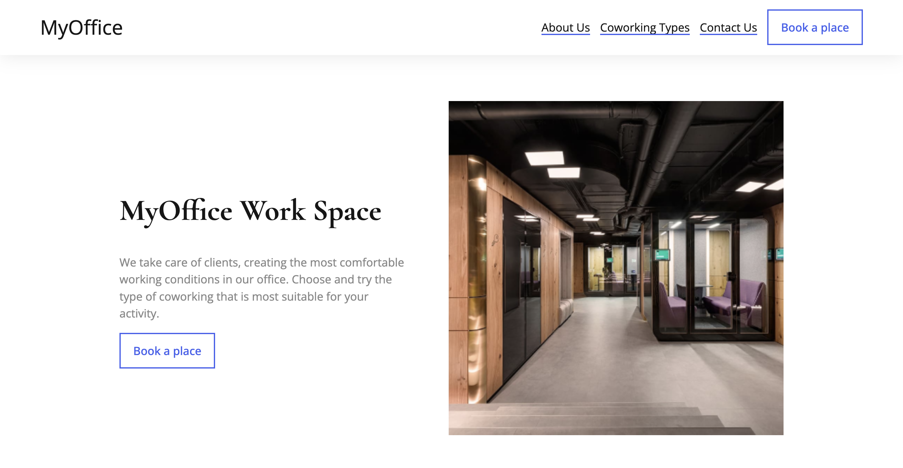
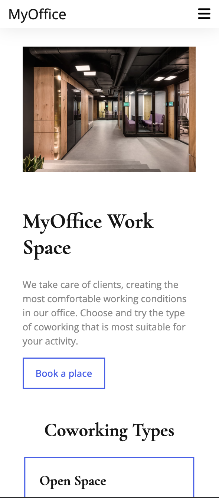

# Epam Coworking

## About

The site provides users with the opportunity to book places in co-working spaces of various types (open, offices, meeting rooms). It consists of several pages: the main page, entry forms, seat reservation and feedback. When sending the feedback form, the data (name and mail of the sender, message) are sent to the e-mail of the administration.

## Built with

## Useful Links

- [Live Preview](https://midjiro.github.io/epam-coworking/)

## Team

- Mykhailo Hulak +380684771085
- Dmytro Boyko +380963033846
- Oleh Hel +380986024421
- Yurii Broslavskyi +380733255011
- Anna-Maria Kischuk +380966606989
- Liza Galaburda +380930021633
- Denys Nemyrka +380634372999
- Oleh Tysovskyi +380989684475
