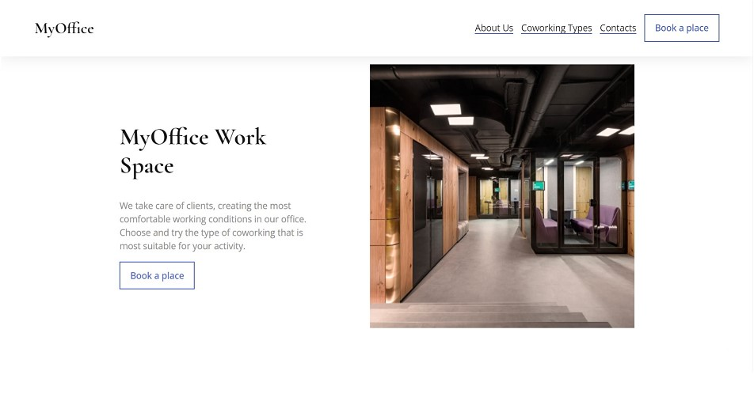
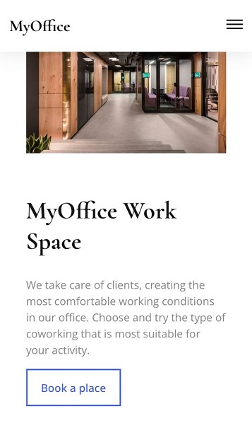

# Epam Coworking

## About

A responsive web page consists of a header (brand, menu button, navigation), main section (about us, pricing and booking) and footer (contact information). The navigation menu collapses on devices with a screen width of less than 768 pixels and automatically expands after resizing if the screen is large enough. The booking form consists of 2 input fields (name and phone number) and 3 radio buttons corresponding to the existing types of coworking. After the form is submitted, a successful submission message should appear on the screen.

## Built with

## Set Up

To start project locally on your machine do the folowing steps:

1. Clone repository

   Attention! Repository will be cloned and saved as the folder with appropriate name in your current working directory. E.g if you are cloning from 'Visual Studio Code/' all project files will be clones into 'Visual Studio Code/epam-coworking/'.

   `git clone https://github.com/midjiro/epam-coworking.git`

2. Switch to dev branch

   Since master branch is used to store use-ready project version, it is undesirable to push all changes in it.

   If you are a team member, please switch to the dev branch using the command

   `git checkout dev`

   or

   `git checkout -b dev`

   in case if such branch does not exists.
   To make sure everything is okay execute

   `git branch`

3. Now you are ready to go!

## Useful Links

- [Live Preview](https://midjiro.github.io/epam-coworking/)
- [Design](https://www.figma.com/file/Qs38vpduuxaWiE7sdCytlj/Coworking?node-id=3-9&t=v2WttIBG22OENl7S-0)

## Contacts

- Mykhailo Hulak +380684771085
- Dmytro Boyko +380963033846
- Oleh Hel +380986024421
- Yurii Broslavskyi +380733255011
- Anna-Maria Kischuk +380966606989
- Liza Galaburda +380930021633
- Denys Nemyrka +380634372999
- Oleh Tysovskyi +380989684475
